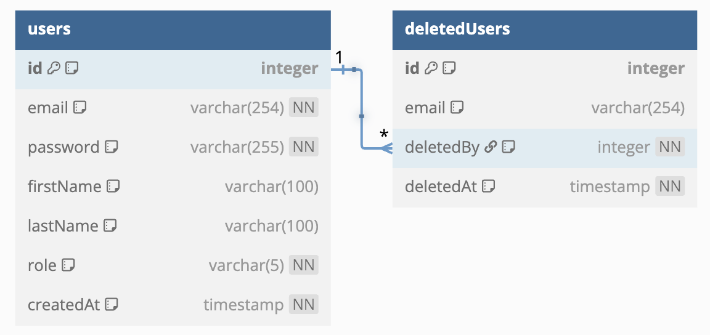
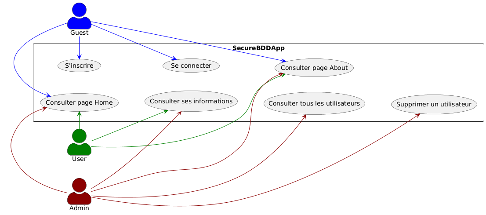
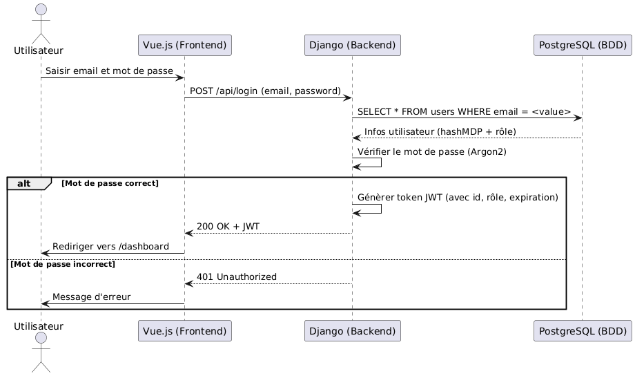
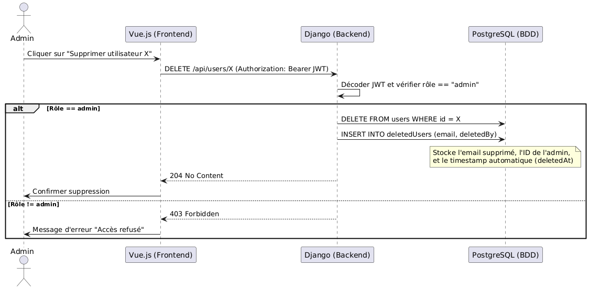

# 📚 Documentation du projet `SecureBDDApp`

## 1. Objectif du projet

Ce projet vise à démontrer la mise en place d'une **application sécurisée Django + PostgreSQL**, conforme aux recommandations **OWASP** et bonnes pratiques DevSecOps. Le système implémente un backend RESTful, une base de données relationnelle, une authentification JWT, des protections contre XSS et BAC, et des scripts de tests automatisés.

---

## 2. Architecture du projet

```
SecureBDDApp
├── backend/
│   ├── app/
│   │   ├── accounts/         # App Django : routes, models, middlewares, views
│   │   ├── secureBDDApp/     # Projet Django
│   │   ├── testAPI.sh        # Script de test API de base
│   │   ├── testAPI2.sh       # Script de test sécurité (injection, privilèges)
│   │   ├── requirements.txt
│   │   └── manage.py
│   ├── Dockerfile
│   └── runOWASPDepCheck.sh
├── databases/
│   ├── genCertsBDD.sh
│   ├── testSSLBDD.sh
│   └── certs/                # Certificats TLS (optionnel)
├── docker-compose.yml
├── Makefile
├── .env                      # Variables d'environnement sensibles
├── README.md
├── securityReports/         # Rapport OWASP Dependency-Check
└── docs/
    ├── mcd.png              # Schéma de la base de données
    ├── casUtilisation.png   # Cas d'utilisation
    ├── sequenceLogin.png    # Diagramme séquence connexion
    └── sequenceSuppression.png # Diagramme suppression utilisateur
```

---

## 3. Schémas du projet

### 🗄️ Schéma MCD (base de données)



### 🧑‍💻 Diagramme de cas d'utilisation



### 🔑 Séquence d'authentification (login JWT)



### 🗑️ Séquence de suppression d'utilisateur



---

## 4. Sécurité mise en place

- ✅ Hachage Argon2id des mots de passe (`argon2-cffi`)
- ✅ Authentification via JWT sécurisé (expirations, rôle, payload)
- ✅ Middleware d'autorisation (`SecureIDORMiddleware`)
- ✅ Middleware anti-bruteforce (`BruteForceProtectionMiddleware`)
- ✅ Vérification stricte des champs (regex, longueurs)
- ✅ Protection contre les attaques XSS par `sanitizing`
- ✅ Tests automatisés API (bash + curl + jq)
- ✅ Scanner de vulnérabilité OWASP Dependency-Check (rapport HTML)

---

## 5. Fonctionnalités utilisateur

- 🔐 Inscription, connexion, suppression du compte
- 👁️ Visualisation des données personnelles
- ⏱️ Blocage temporaire après tentatives échouées
- 🔐 Autorisation des routes sensibles (admin)
- 🗑️ Suppression logique avec journalisation (deletedUsers)

---

## 6. Limitations actuelles

- ⚠️ Fonction de modification des informations non implémentée
- ⚠️ Frontend non intégré (API REST uniquement)
- ⚠️ Pas de sécurisation SSL/TLS PostgreSQL (abandonné pour simplification)
- ⚠️ Pas de suppression en cascade des ressources liées

---

## 7. Améliorations possibles

- 🔄 Ajout d'un frontend Vue.js ou React sécurisé
- 🔐 Activation du support TLSv1.3 sur PostgreSQL avec certificats auto-signés ou délivrés par une autorité (ex : Let's Encrypt)
- 🔍 Intégration d’une analyse statique du code (SonarQube ou Bandit)
- 📦 Intégration d’un pipeline CI/CD (ex : GitHub Actions) avec build, tests et déploiement automatique de l’image Docker
- ⚙️  Mise en production derrière un reverse proxy Nginx configuré en HTTPS avec des en-têtes de sécurité  (HSTS, CSP, etc).
- 🔓 Sécurisation des tokens JWT :
    - Invalidation manuelle après déconnexion
    - Stockage sécurisé côté client (ex : HttpOnly, Secure, SameSite)
---

## 8. OWASP Dependency-Check

```bash
sudo make startOWASPDepCheck
sudo make runOWASPDepCheck
```

Exemple de rapport généré dans : `./securityReports/dependency-check-report.html`

---

## 9. Scripts de test (API + sécurité)

```bash
sudo ./backend/app/testAPI.sh       # Tests basiques : inscription, login, privilèges
sudo ./backend/app/testAPI2.sh      # Tests injections, élévation de privilèges
```

---

## 10. Dockerisation

L'application est contenue dans un `docker-compose.yml` prêt à l’emploi.

```bash
docker compose up -d --build
```

L’image Docker est en cours de push dans la branche `releases`, puis validée dans `main`.

---

## 11. Variables d’environnement (.env)

```env
POSTGRES_USER=<value>
POSTGRES_PASSWORD=<value>
POSTGRES_DB=<value>
DJANGO_SECRET_KEY=<value>
DJANGO_PORT=<value>
...
```

---

## 12. Auteurs et mentions

- Réalisé dans le cadre du projet SecureBDDApp
- Encadré par une exigence de sécurité web réaliste (Django + PostgreSQL)
- Auteur : Michel WU, étudiant IPSSI promo 2026
